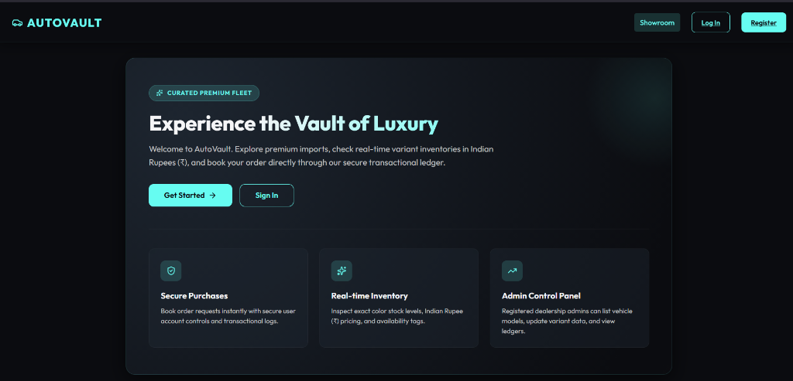
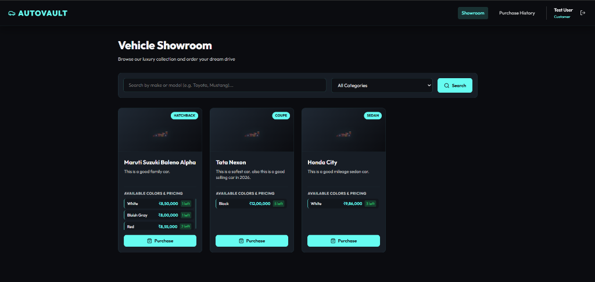
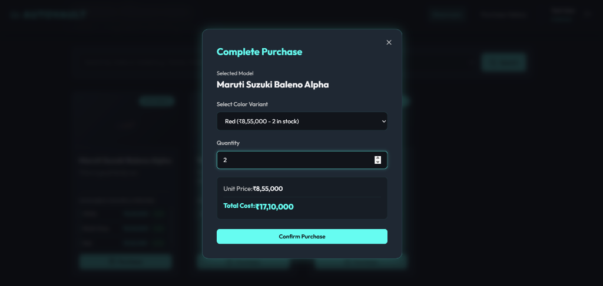
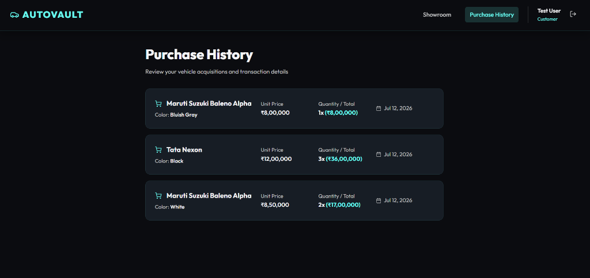
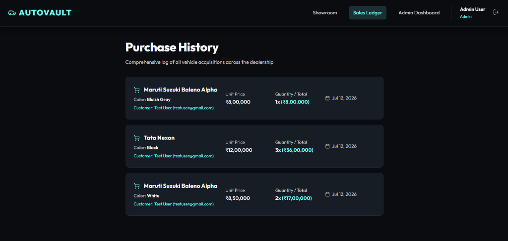
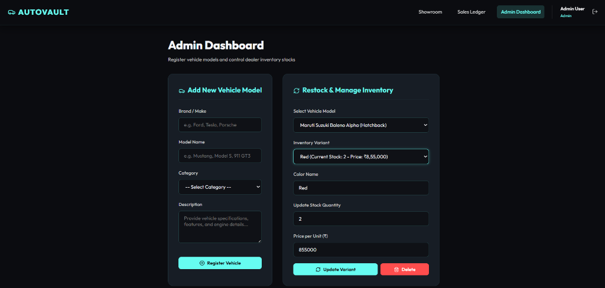

# AutoVault - Car Dealership Inventory System

AutoVault is a premium, state-of-the-art Car Dealership Inventory Management Web Application. It provides customer and administrator portals to explore, purchase, restock, and manage luxury vehicle models and their color-specific inventory variants.

---

## Key Features

1. **Premium Vehicle Showroom**:
   - Seamless browsing of luxury cars with responsive grid layout (1 to 4 columns depending on screen size).
   - High-quality visual cards showing vehicle details, descriptions (with clean two-line alignment), and color variants.
   - Prices formatted in Indian Rupees (₹) using local numbering systems (e.g. Lakh/Crore formatting `1,50,000` instead of `150,000`).

2. **Guest Welcome Portal**:
   - An eye-catching welcome hero banner with glassmorphic design and bullet points introducing the platform to unauthenticated users.
   - Public access to showroom browsing without showing unauthorized token errors.

3. **Admin Dashboard**:
   - Register new vehicle models to the dealership catalog.
   - Full control over vehicle variants: edit color names, adjust absolute stock quantities, or modify prices directly.
   - Safely delete variant options from the inventory without affecting historical transaction sales records.

4. **Transaction Management**:
   - Seamless purchase workflows for registered customers.
   - Transaction ledger history tracking specific quantities, dates, unit prices, and total purchase costs.

---

## Detailed Functionality Explanation

### 1. Authentication & Session Security

- **Role-Based Portals**: Users register and log in under specific roles:
  - **Customers**: Can browse the showroom, inspect active color stock levels, buy vehicles, and view their personal transaction histories.
  - **Admins**: Authorized to manage the vehicle catalog, control color variants/stocks, adjust pricing, delete records, and audit the entire dealership sales history.
- **Token-Based Sessions**: Authentication is handled via secure JSON Web Tokens (JWT) stored in HTTP-only, credential-enabled cookies to protect against XSS and session spoofing.
- **Route Guards**: Implements frontend guards (`ProtectedRoute`) that prevent unauthorized visitors from accessing historical ledgers or admin panels.

### 2. Vehicle Showroom Catalog

- **Responsive Layout Grid**: A clean, CSS-based responsive showroom displays exactly **4 cards** per row on desktops, **3 cards** on standard tablets/laptops, **2 cards** on smaller screens, and stacks dynamically to **1 column** on mobile devices.
- **Visual Uniformity**: Card containers automatically align. Descriptions are capped at exactly two lines using ellipsis truncation, and all horizontal dividers and variant headers start at the exact same vertical level.
- **Indian Rupee (₹) Localization**: All price listings, checkout calculations, unit costs, and admin controls are localized using the Indian Rupee symbol (`₹`) and the `en-IN` formatting locale (e.g. displaying `₹12,00,000` instead of `₹1,200,000`).
- **Guest Browsing**: Unauthenticated users can browse the showroom catalog freely. Clicking details triggers a clean toast warning inviting them to register/login.

### 3. Inventory & Variant Control (Admin)

- **Granular Spec Control**: Admins can register new vehicle models (defining make, model, category, and description specs).
- **Variant Management**: Admins can add multiple color options for each vehicle model (each with specific unit prices and initial quantities).
- **Inline Editing**: Admins can select any active variant from a dropdown to edit its color name, absolute stock quantity, or unit price directly.
- **Safe Variant Deletion**: Admins can completely delete a specific color variant from the catalog. This removes the variant from the showroom, but keeps past purchase logs associated with it fully intact in the database.

### 4. Custom Confirmation Modals

- **Replaced Alert Boxes**: Replaced browser-native popup dialogs (e.g., `window.confirm`) with customized React modal popups for deletion alerts.
- **Theme-Integrated Dialogs**: Custom confirmation boxes are styled with glassmorphic cards, warning icons, safety disclaimers, and interactive action buttons.

### 5. Sales Ledger & Purchase Checkout

- **Instant Stock Deductions**: Deducts purchased quantities from the inventory variants during checkout. If stock is insufficient, the system rejects the transaction.
- **Ledger Records**: Customer purchase histories list unit prices, quantities, total costs, and dates. Admins see the dealer-wide sales history, including buyer contact information.

---

## Screenshots

### 1. Guest Showroom (Welcome Hero Banner)


### 2. Vehicle Showroom (Logged-In Customer)


### 3. Complete Purchase Dialog


### 4. Customer Purchase History


### 5. Admin Sales Ledger


### 6. Admin Dashboard (Vehicle & Variant Management)


---

## Technology Stack

- **Frontend**:
  - React 19 (using modern Context hooks and state management)
  - Vite (lightning-fast development server and asset bundler)
  - Vanilla CSS (custom design system with glassmorphic styles, transitions, and HSL tokens)
  - Lucide React (sleek modern iconography)
  - React Router DOM (client-side routing)

- **Backend**:
  - Node.js & Express
  - MongoDB & Mongoose (object data modeling for inventory schemas)
  - JWT (JSON Web Tokens for secure session-based cookie authentication)
  - Bcrypt.js (secure password hashing)

---

## API Endpoints Reference

Below is a detailed breakdown of all the backend REST API endpoints available in the system. The base URL for all API requests is `/api`.

### 1. Authentication (`/auth`)

| Method | Endpoint         | Access    | Description                                                                                              |
| :----- | :--------------- | :-------- | :------------------------------------------------------------------------------------------------------- |
| `POST` | `/auth/register` | Public    | Registers a new user (expects `name`, `email`, `password`, and optional `role` in the request body).     |
| `POST` | `/auth/login`    | Public    | Authenticates credentials (expects `email`, `password` in body) and issues a secure JWT httpOnly cookie. |
| `POST` | `/auth/logout`   | Public    | Clears the auth session cookies to log out the user.                                                     |
| `GET`  | `/auth/me`       | Protected | Fetches the account profile details of the currently signed-in user.                                     |

### 2. Vehicle Catalog (`/vehicles`)

| Method   | Endpoint                 | Access    | Description                                                                                              |
| :------- | :----------------------- | :-------- | :------------------------------------------------------------------------------------------------------- |
| `GET`    | `/vehicles`              | Public    | Fetches all vehicle models registered in the system.                                                     |
| `GET`    | `/vehicles/search`       | Public    | Searches and filters the catalog by keywords, category, or min/max price range.                          |
| `POST`   | `/vehicles`              | Admin     | Registers a new vehicle model (expects `make`, `model`, `category`, and optional `description` in body). |
| `PUT`    | `/vehicles/:id`          | Admin     | Updates vehicle specs (make, model, category, description) by ID.                                        |
| `DELETE` | `/vehicles/:id`          | Admin     | Deletes a vehicle model by ID (which cascades to delete its color variants).                             |
| `POST`   | `/vehicles/:id/purchase` | Protected | Places a purchase order for a variant of this vehicle (expects `color`, `quantityPurchased` in body).    |
| `POST`   | `/vehicles/:id/restock`  | Admin     | Restocks or creates a new color variant under this vehicle model.                                        |

### 3. Inventory Variants (`/inventory`)

| Method   | Endpoint         | Access | Description                                                                                            |
| :------- | :--------------- | :----- | :----------------------------------------------------------------------------------------------------- |
| `GET`    | `/inventory`     | Public | Fetches all color variant inventory records in the dealership database.                                |
| `POST`   | `/inventory`     | Admin  | Creates a new color variant for a vehicle (expects `vehicleId`, `color`, `quantity`, `price` in body). |
| `PUT`    | `/inventory/:id` | Admin  | Updates the specs (color name, absolute stock quantity, or unit price) of a specific variant.          |
| `DELETE` | `/inventory/:id` | Admin  | Deletes an inventory variant record by ID (does not affect past purchase records).                     |

### 4. Transactions & Sales (`/purchases`)

| Method | Endpoint     | Access    | Description                                                                                                              |
| :----- | :----------- | :-------- | :----------------------------------------------------------------------------------------------------------------------- |
| `POST` | `/purchases` | Protected | Places an order for an inventory variant (expects `inventoryId`, `quantityPurchased` in body).                           |
| `GET`  | `/purchases` | Protected | Retrieves transaction ledger details (Customers see only their own history, Admins see the entire dealership sales log). |

---

## Setup & Local Installation

### Prerequisites

- [Node.js](https://nodejs.org/) (v16 or higher recommended)
- [MongoDB](https://www.mongodb.com/try/download/community) running locally (port `27017`)

---

### 1. Backend Setup

1. Navigate to the backend directory:

   ```bash
   cd car-dealership-inventory/backend
   ```

2. Install dependencies:

   ```bash
   npm install
   ```

3. Create/verify the environment file (`.env`) in the root of the `backend` folder:

   ```env
   PORT=8080
   MONGODB_URI=mongodb://127.0.0.1:27017/car-dealership
   JWT_SECRET=your_jwt_secret_token_here
   ```

4. Start the backend development server:
   ```bash
   npm run dev
   ```
   _The API server will run at `http://localhost:8080`._

---

### 2. Frontend Setup

1. Navigate to the frontend directory:

   ```bash
   cd car-dealership-inventory/frontend
   ```

2. Install dependencies:

   ```bash
   npm install
   ```

3. Start the Vite React development server:
   ```bash
   npm run dev
   ```
   _The frontend client will spin up at `http://localhost:5173`._

---

## My AI Usage

### AI Tools Used

- **Gemini (via Antigravity AI Coding Assistant)**

### How AI Was Used

1. **Localizing Currency representation**:
   - Instructed Gemini to modify the React views across [Vehicles.jsx](file:///car-dealership-inventory/frontend/src/pages/Vehicles.jsx), [PurchaseHistory.jsx](file:///car-dealership-inventory/frontend/src/pages/PurchaseHistory.jsx), and [AdminDashboard.jsx](file:///car-dealership-inventory/frontend/src/pages/AdminDashboard.jsx) to replace the default USD `$` symbol with the Indian Rupee `₹` symbol.
   - Asked Gemini to apply `toLocaleString('en-IN')` to format vehicle prices using the Indian numbering system.

2. **Improving Admin Variant Control**:
   - Used Gemini to refactor the restocking form to support direct updates (editing color names, setting absolute quantity levels, and updating prices).
   - Designed code to query the backend `PUT /api/inventory/:id` route when updating variant fields.
   - Implemented a delete mechanism for individual color variants (`DELETE /api/inventory/:id` controller/route), ensuring that past transaction logs on the `Purchase` collection are preserved and not cascade-deleted.

3. **Enhancing Showroom UI/UX and Responsiveness**:
   - Instructed Gemini to implement CSS media queries for `.vehicles-grid` inside [index.css](file:///car-dealership-inventory/frontend/src/index.css) to build a responsive layout displaying exactly 4 cards per row on desktops, 3 on tablets, 2 on small tablets, and 1 on mobile screens.
   - Asked Gemini to align horizontal line separators and layout components across cards by implementing fixed description heights and removing flex grow heights from card text blocks.
   - Leveraged Gemini to build a guest welcome hero banner with premium dark/neon styling and custom feature lists visible only when no active user session is present.
   - Refactored routes in `vehicles.js` to remove authentication blocks on catalog searches, resolving unauthorized API token console errors when guest users load the page.